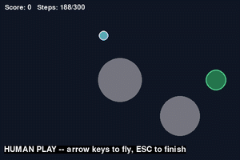

# DroneDelivery_RL_Game

A small 2D drone-delivery game built as a Gym-style NumPy environment, plus a
Deep Q-Network (DQN) agent trained from scratch to fly around obstacles and
deliver. Includes human play, a saved policy, training/evaluation scripts, and
a recorded demonstration.



### Training curve


## The game

- 600×400 2D map, **two fixed circular obstacles** and **one delivery zone**
  (the larger obstacle blocks the straight path — a direct dash always crashes)
- The drone has **momentum** (velocity with drag), so it must anticipate its
  own inertia and counter-thrust to slow down
- Episode ends on **delivery** (success), **collision** (crash), or a
  **300-step time limit**; visible score + step counter, auto-reset

## Reinforcement learning formulation

| Part | Choice |
|---|---|
| **Observations** | 6 numbers: normalized position (x, y), velocity (vx, vy), direction to target (dx, dy) |
| **Actions** | 5 discrete: thrust left / right / up / down / hover |
| **Reward** | +100 delivery, −100 crash, −1 per step, −25 timeout, plus potential-based shaping (0.5 × Δφ) rewarding distance progress and obstacle avoidance |

The shaping is potential-based (Ng, Harada & Russell, 1999), so it speeds up
learning without changing the optimal policy. Its obstacle "safety ring" term
is what teaches the agent to detour instead of hugging the shortest line.

**Algorithm: DQN** — MLP Q-network (6 → 128 → 128 → 5), experience replay
(50k), target network (sync every 1,000 learn steps), ε-greedy 1.0 → 0.05 over
700 episodes, Adam (lr 1e-3), γ = 0.99, batch 128, Huber loss.

## Results

Training reaches a 100% success rate (50-episode average) around episode 750;
the best checkpoint is kept. 10-episode evaluation on identical starting
scenarios (`evaluate.py`):

| Agent | Avg reward | Deliveries | Crashes | Avg steps |
|---|---|---|---|---|
| **Trained DQN** | **+148.1** | **10/10** | 0/10 | 183.0 |
| Random | −332.6 | 0/10 | 0/10 | 300.0 (all time out) |

The agent's key learned behavior: an arcing detour around the central
obstacle, arriving well under the step limit with zero crashes.

## Quick start

```bash
pip install -r requirements.txt

python train.py        # train from scratch (~minutes on CPU)
python evaluate.py     # trained vs random, 10 episodes each
python play.py human   # fly it yourself (arrow keys)  [needs pygame]
python play.py agent   # watch the saved DQN policy fly
```

A pre-trained policy is included (`dqn_drone.pth`), so `evaluate.py` and
`play.py agent` work without training.

## Repository layout

```
drone_env.py                      Game environment (physics, reward, pygame renderer)
dqn_agent.py                      DQN agent (Q-network, replay buffer, target net)
train.py                          Training script (saves policy, plot, log)
evaluate.py                       Trained vs random evaluation, same seeds
play.py                           Human play / trained-agent visual demo
record_demo.py                    Records a demo MP4/GIF with captions
make_demo_gif.py                  Builds demo.gif (README preview) from demo.mp4
drone_delivery_assignment.ipynb   Notebook version of the full pipeline
dqn_drone.pth                     Saved best policy
training_plot.png                 Training reward curve
training_log.csv                  Raw per-episode rewards
evaluation_results.csv            10-episode comparison table
demo.gif                          Preview clip for this README (from demo.mp4)
demo.mp4                          Recorded human + agent demonstration
```

## Implementation notes

- Pure NumPy physics — no game engine or external environment; pygame is used
  only for optional visualization
- Best checkpoint keeping: training monitors the 50-episode success rate and
  saves the best policy, protecting against late-run DQN drift
- Reward shaping follows Ng, Harada & Russell (1999),
  *Policy invariance under reward transformations*

## License

MIT — see [LICENSE](LICENSE).
