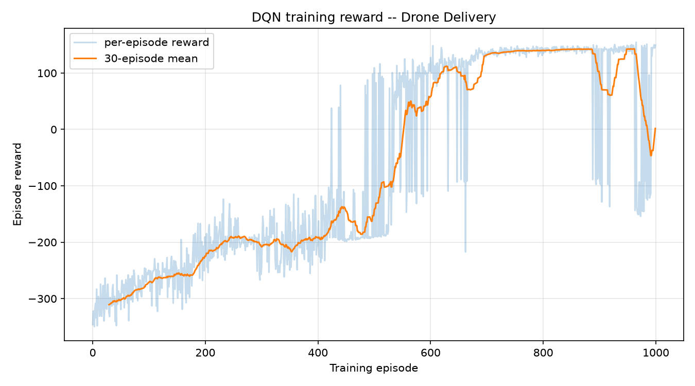

# Drone Delivery — Reinforcement Learning Game Assignment 2

**Name:** MD Sujan Miah  **Student ID:** 251050602  **Reg No:** 60761  **Course:** Reinforcement Learning

**Assignment title:** Option 2 — Drone Delivery (DQN)

---

## 1. Game objective

Drone Delivery is a small 2D game (600×400 px). A drone starts on the left of
the map and must reach the delivery zone on the right. Two fixed circular
obstacles block the way — the larger one sits exactly on the straight
start→target line, so flying directly at the target always crashes. The drone
has momentum (velocity with drag), making control non-trivial: it cannot stop
instantly and must anticipate its own inertia.

An episode ends when the drone (a) reaches the delivery zone — **success**,
(b) collides with an obstacle — **crash**, or (c) exceeds 300 steps — **time
out**. The visible score (delivered = +100) and step counter are shown on
screen, and the game auto-resets after every episode. Human play uses the
arrow keys for thrust (left/right/up/down, releasing keys = hover).

## 2. Observations, actions, and reward

**Observations (6 numbers, compact — no camera images):**

| Index | Meaning |
|---|---|
| 0–1 | drone position x, y (normalized to the world size) |
| 2–3 | velocity vx, vy (normalized by max speed) |
| 4–5 | direction to target (dx, dy), normalized |

**Actions (5 discrete):** move left, move right, move up, move down, hover.

**Reward (numerical values):**

| Event | Reward | Why |
|---|---|---|
| Reach delivery zone | **+100** | the goal |
| Collide with obstacle | **−100** | crash |
| Each time step | **−1** | encourages finishing fast instead of wandering |
| Time out at 300 steps | extra **−25** | mild penalty for stalling |
| Potential-based shaping | 0.5 × Δφ per step | see below |

The shaping term is potential-based (Ng, Harada & Russell, 1999):
φ(s) = −(distance to target) − (intrusion into a 25-px safety ring around each
obstacle), and the step reward includes 0.5 × (φ(s′) − φ(s)). It rewards both
closing the distance and *detouring around* obstacles — without the safety-ring
term the shortest-reward path would graze the central obstacle. Because the
shaping is potential-based, it does not change the optimal policy.

## 3. Algorithm and main settings

**Algorithm: Deep Q-Network (DQN).** A 3-layer MLP (6 → 128 → 128 → 5, ReLU)
approximates Q(s, a); the agent picks the action with the highest Q-value,
exploring ε-greedily. Standard stabilization tricks are used: experience
replay and a target network. Loss is smooth L1 (Huber) with gradient-norm
clipping at 10.

| Setting | Value |
|---|---|
| Episodes | 1000 (seed 0) |
| ε: linear decay | 1.0 → 0.05 over the first 700 episodes |
| γ (discount) | 0.99 |
| Optimizer | Adam, lr = 1e-3 |
| Replay buffer / batch | 50,000 transitions / 128 |
| Target network sync | every 1,000 learn steps |
| Learn frequency | one gradient step every 2 env steps |

Training takes a few minutes on CPU. The **best checkpoint** is kept by
monitoring the 50-episode success rate during training, which protects against
the late-training drift that DQN sometimes shows.

## 4. Training results

The plot shows the per-episode reward (faint) and the 30-episode moving
average (bold). The progression:

- **Episodes 1–400:** all exploration. Random thrusting usually ends in a
  crash or time-out (avg ≈ −290 in the first 100 episodes).
- **Episodes 400–600:** the agent first touches the target occasionally
  (50-episode success rate 0.06 → 0.48); the 50-episode average reward turns
  positive around episode 570.
- **Episodes 600–750:** rapid improvement as ε decays: success 0.78 → 0.96 →
  1.00. The best checkpoint (50-episode success 1.00) is saved around
  episode 750.
- **Episodes 750–1000:** performance is high but drifts at the very end
  (success 0.58 in the last 50 episodes) — typical DQN overestimation wobble;
  the saved best policy is from the stable peak. Final-100 average reward is
  +70.8, best single episode +154.6.

A greedy sanity check with the saved best policy scores **10/10 deliveries**.

## 5. Evaluation: trained vs random agent (10 episodes each)

Both agents run the same 10 starting scenarios (identical seeds) via
`python evaluate.py`; results are saved in `evaluation_results.csv`.

| Agent | Avg episode reward | Deliveries | Crashes | Avg steps |
|---|---|---|---|---|
| **Trained DQN** (greedy) | **+148.1** | **10/10** | 0/10 | 183.0 |
| Random | −332.6 | 0/10 | 0/10 | 300.0 (all time out) |

The trained agent delivers in **every** scenario with no crashes. The random
agent never delivers: it mostly idles or drifts into walls until the time
limit, collecting the −1-per-step cost (and the −25 time-out penalty), which
explains its ≈ −333 average. The reward gap of ≈ 480 comes from the +100
delivery bonus, the avoided time-out penalty, and ~117 fewer wasted steps.

## 6. Discussion

**One successful behavior.** The agent learned to *detour around the central
obstacle*. Early in training a straight dash at the target almost always
crashes; the safety-ring shaping taught it that approaching the obstacle ring
is costly, and it converged to an arcing path (typically over the obstacle)
that keeps a safe margin while still using its momentum efficiently —
arriving in ~183 steps on average, well under the 300-step limit.

**One limitation.** The policy is deterministic at evaluation and was trained
from a single fixed start position against fixed obstacles, so it may not
generalize to randomized starts, moving obstacles, or wind. The training curve
also shows late-run drift (success dropping to 0.58 near episode 1000), a
known DQN instability; the evaluation uses the best saved checkpoint rather
than the final weights.

**One improvement.** Randomize the drone's start position (and optionally the
obstacle layout) during training so the Q-function learns a family of paths
instead of one; adding Double-DQN would directly address the overestimation
that causes the late-training drift. Either change should make a fresh
checkpoint stable without relying on best-checkpoint keeping.

## 7. Libraries and acknowledgements

All game and training code was written for this assignment — no external game
environment or physics engine is used (pure NumPy physics). Libraries:
**numpy** (environment), **pytorch** (DQN), **matplotlib** (plot),
**pygame** (optional visualization only). The reward-shaping method follows
Ng, Harada & Russell (1999), *Policy invariance under reward transformations*.
